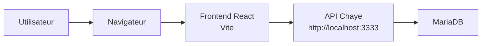
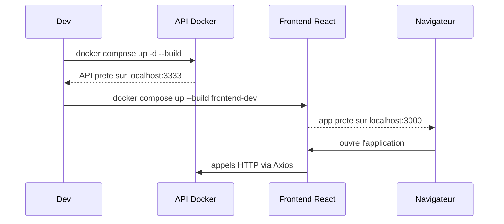
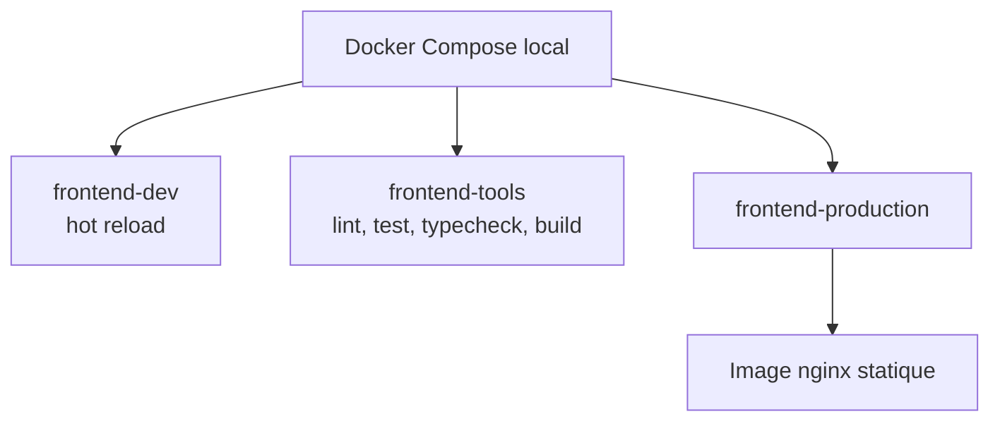
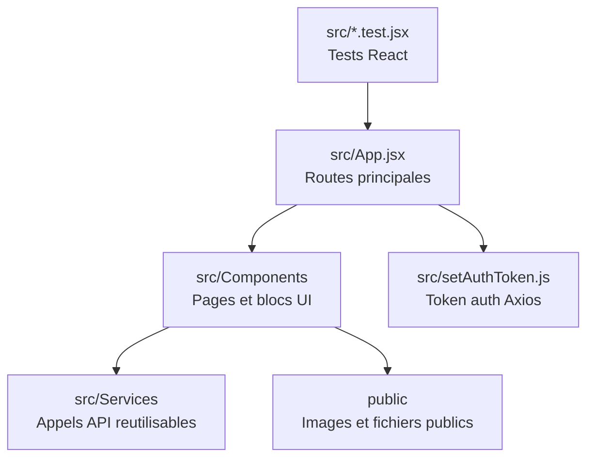
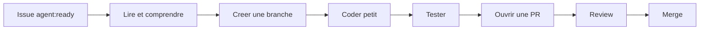
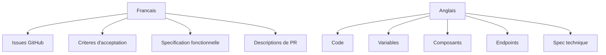
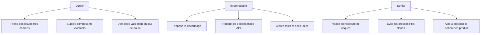
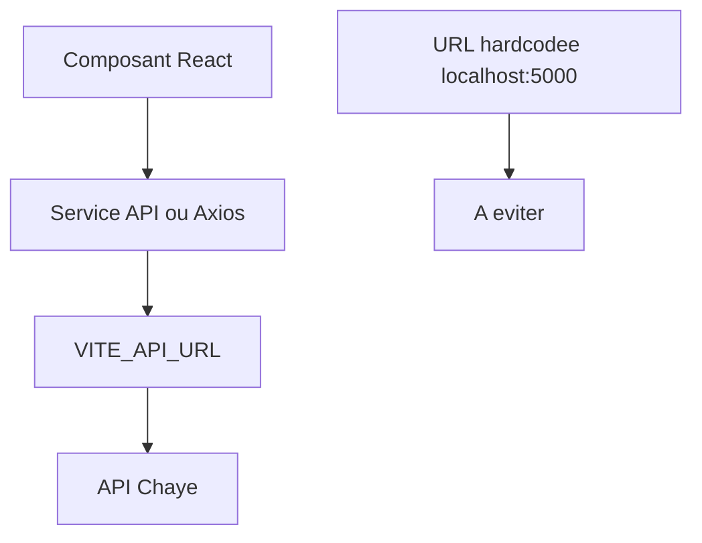
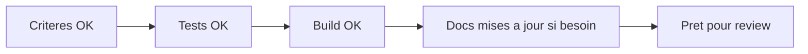
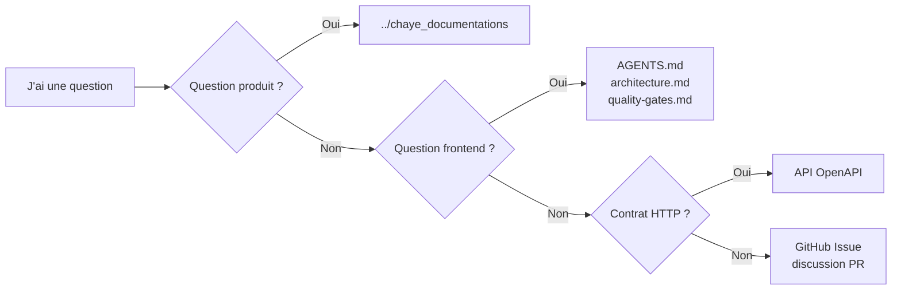

# Chaye Web Frontend - Guide d'arrivee pour nouveau dev

Bienvenue dans le frontend Chaye.

Ce README sert a aider un nouveau dev a installer le projet, comprendre le workflow GitHub et contribuer sans se perdre dans tout le code existant.

La documentation produit transverse vit en francais dans `../chaye_documentations`.

Les details techniques propres au frontend restent dans `AGENTS.md` et dans `docs/`.

## Vue Simple

Ce repo contient l'application web React.

Elle sert a:

- afficher les pages vues par les utilisateurs;
- appeler l'API Chaye;
- gerer les formulaires;
- afficher les parcours comme inscription, profil, annonces et support.



## Installation Locale

### Prerequis

Installe d'abord:

- Docker Desktop;
- Git;
- GitHub CLI: `gh`;
- un editeur de code.

Node.js et npm ne sont pas requis sur la machine locale. Le frontend utilise Node.js 24 dans Docker Compose.

Verifie:

```bash
docker --version
gh auth status
```

## Demarrer Le Produit En Local

Le produit complet utilise deux repos:

- `chaye_API` pour le backend;
- `chaye_web_frontend` pour l'interface web.

Pour travailler confortablement, demarre d'abord l'API avec Docker, puis le frontend.



### 1. Demarrer L'API

Depuis le dossier API:

```bash
cd ../chaye_API
docker compose up -d --build
docker compose logs -f api
```

API attendue:

```text
http://localhost:3333
```

### 2. Installer Le Frontend

Depuis ce dossier:

```bash
cd ../chaye_web_frontend
docker compose build frontend-tools
docker compose run --rm frontend-tools npm ci
```

### 3. Demarrer Le Frontend

```bash
docker compose up --build frontend-dev
```

Application attendue:

```text
http://localhost:3000
```

## Docker Cote Frontend

Docker Compose est l'interface locale obligatoire pour le developpement, les tests et les builds. Le service `frontend-dev` fournit le hot reload. Le service `frontend-tools` execute les commandes npm dans Node.js 24 sans installer Node.js sur l'hote.

Commandes principales:

```bash
docker compose up --build frontend-dev
docker compose run --rm frontend-tools npm run lint
docker compose run --rm frontend-tools npm run typecheck
docker compose run --rm frontend-tools npm test -- --watchAll=false
docker compose run --rm frontend-tools npm run build
docker compose run --rm frontend-tools npm run check
```

Pour verifier l'image de production:

```bash
docker compose build frontend-production
docker compose up frontend-production
```



## Comprendre Le Repo



Lecture conseillee avant de coder:

1. `../chaye_documentations/README.md`
2. `../chaye_documentations/produit/README.md`
3. `../chaye_documentations/processus/README.md`
4. `../chaye_documentations/sources-pdf/README.md`
5. `AGENTS.md`
6. `docs/architecture.md`
7. `docs/quality-gates.md`
8. l'issue GitHub sur laquelle tu travailles

La specification produit transverse vit dans `../chaye_documentations`. Les contrats HTTP publics vivent dans `../chaye_API/docs/openapi/openapi.yaml`. Le statut du travail vit dans GitHub Issues.

## Workflow Avec Les Issues GitHub

Une issue GitHub est une petite mission. Elle explique quoi faire et comment savoir que c'est fini.



### 1. Trouver Une Issue

```bash
gh issue list --repo Chaye-parcel-traveler/chaye_web_frontend --label agent:ready
```

Lis l'issue comme un contrat:

- objectif;
- contexte;
- criteres d'acceptation;
- labels;
- dependances API eventuelles.

Si l'issue contient `blocked:backend-contract`, cela veut dire que le frontend depend d'un contrat API pas encore pret ou pas encore stabilise.

### 2. Creer Une Branche

```bash
git checkout -b issue-12-short-description
```

Exemple:

```bash
git checkout -b issue-8-cgu-checkbox
```

### 3. Coder En Gardant Le Changement Petit

Evite de melanger:

- une nouvelle fonctionnalite;
- une refonte CSS;
- un renommage massif;
- une correction technique non liee.

Si tu decouvres un autre probleme, cree ou commente une autre issue.

### 4. Lancer Les Verifications

Avant de demander une review:

```bash
docker compose run --rm frontend-tools npm ci
docker compose run --rm frontend-tools npm run check
docker compose build frontend-production
```

En local, n'execute pas les commandes `npm` directement sur l'hote. Utilise toujours le service `frontend-tools`.

Si tu touches l'integration API, demarre aussi le backend Docker et teste le parcours dans le navigateur.

### 5. Ouvrir Une Pull Request

```bash
gh pr create --repo Chaye-parcel-traveler/chaye_web_frontend
```

Dans la PR:

- resume le changement en francais;
- garde les termes techniques en anglais;
- lie l'issue avec `Closes #numero` si la PR termine vraiment l'issue;
- indique les commandes lancees.

## Regles De Langue



Exemple correct:

```text
Ajouter une case CGU obligatoire avant l'appel `POST /members`.
```

## Niveaux De Seniorite

Le workflow est le meme pour tout le monde. Ce qui change, c'est le niveau d'autonomie.



Pour un nouveau dev, le bon reflexe est:

1. partir d'une issue;
2. chercher un composant similaire;
3. copier le style du code existant;
4. faire petit;
5. verifier;
6. demander review.

## API Et Appels Reseau

Le frontend doit utiliser:

```js
import.meta.env.VITE_API_URL
```

En local:

```bash
VITE_API_URL=http://localhost:3333 docker compose up --build frontend-dev
```

Attention: certains anciens composants utilisent encore `http://localhost:5000` directement. Ne copie pas ce pattern. Quand tu touches ces fichiers, migre vers la configuration Axios base URL.



## Definition De Fini

Une issue frontend est vraiment finie quand:

- les criteres d'acceptation sont couverts;
- l'UI reste coherent avec l'existant;
- les appels API utilisent le bon contrat;
- `docker compose run --rm frontend-tools npm run check` passe;
- `docker compose build frontend-production` passe;
- la PR explique clairement ce qui a ete fait.



## Ou Chercher L'Information



Ne crée pas une copie locale d'une information déjà portée par GitHub Issues, OpenAPI ou `../chaye_documentations`. Les PRs feature ne modifient pas les Markdown par défaut; les changements de workflow passent par une PR `OPS`.
