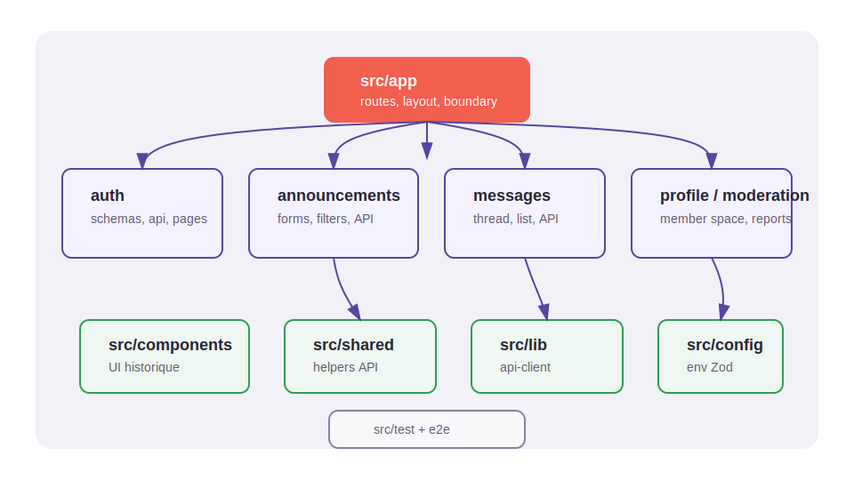
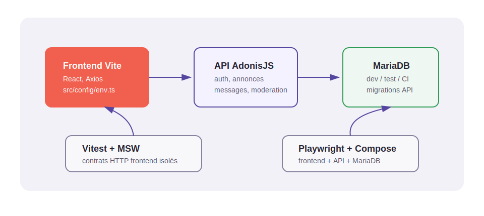

# Architecture frontend

## Objectif

Le frontend évolue progressivement vers une organisation proche de la branche
`task/lboi/use_chaye_api_backend`, sans casser les écrans métier existants.

## Flux applicatif

Le SVG est généré depuis `scripts/generate-doc-diagrams.mjs`. Voir
[`docs/diagrams.md`](diagrams.md) pour la procédure de régénération.

## Principes

- `src/app` compose l'application et centralise les routes.
- Les routes chargent des pages via `React.lazy` depuis `src/features`.
- `src/features` porte les capacités métier.
- `src/components` reste disponible pour les composants historiques et partagés.
- `src/config/env.ts` valide la configuration frontend exposée par Vite.
- `src/lib/api-client.ts` porte Axios et la normalisation d'erreurs.
- `src/features/*/api/*.ts` porte les appels métier par feature.
- `src/shared` porte les helpers techniques réutilisables.
- `src/test` contient l'infrastructure MSW/Vitest.

## Données et API

Le frontend ne se connecte jamais directement à MariaDB. Les tests E2E utilisent
MariaDB via l'API AdonisJS dans `compose.e2e.yml`.

## Sources de vérité

| Sujet                      | Source de vérité                                                         |
| -------------------------- | ------------------------------------------------------------------------ |
| Routes UI                  | `src/app/router.tsx`                                                     |
| Configuration frontend     | `src/config/env.ts`                                                      |
| Payloads et validations UI | Schemas Zod dans `src/features/*`                                        |
| Appels HTTP frontend       | `src/features/*/api/*.ts`                                                |
| Contrats backend réels     | Endpoints exposés par `Chaye-parcel-traveler/chaye_API`                  |
| Schéma MariaDB             | Migrations du dépôt API                                                  |
| Stack E2E complète         | `compose.e2e.yml` et [`docs/e2e.md`](e2e.md)                             |
| Diagrammes                 | `scripts/generate-doc-diagrams.mjs` et [`docs/diagrams.md`](diagrams.md) |

Quand un comportement diffère entre frontend et backend, le backend reste la
source de vérité pour les règles serveur, les statuts, les permissions, les
migrations et les champs réellement persistés. Le frontend documente et teste sa
façon de consommer ces contrats.

## Migration progressive

Les nouveaux écrans doivent être ajoutés dans `src/features/<capability>/`.
Quand un ancien composant de `src/components` devient stable, il peut être
déplacé vers sa feature avec mise à jour des imports et vérification complète.
